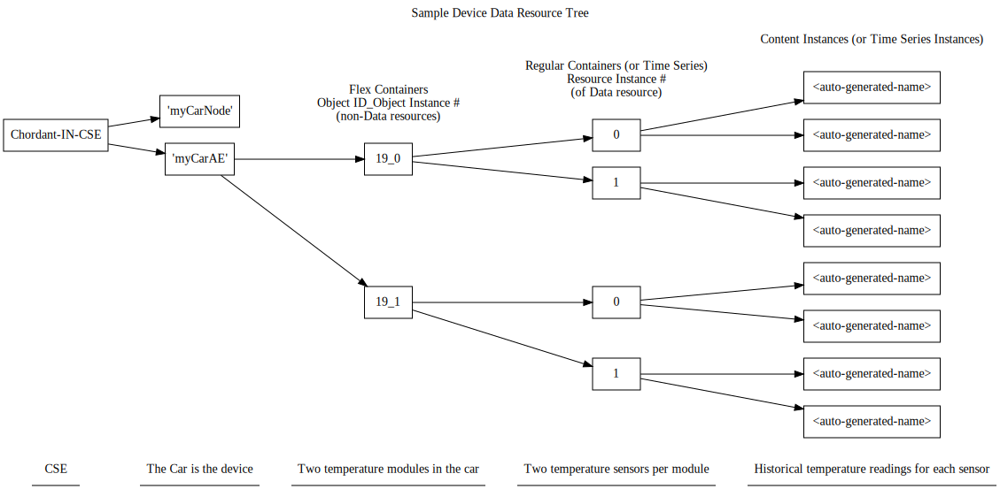
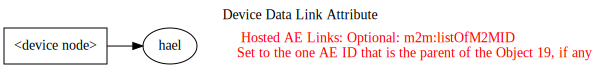
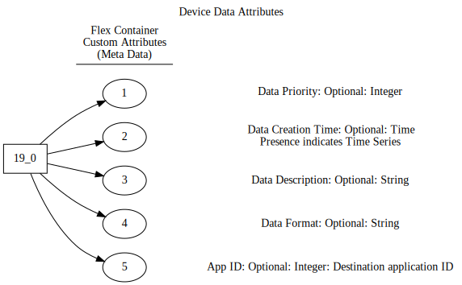

# SDPPROD-1162: Management Console to handle device data
Red indicates an issue, assumption, or question.
## Device Data Resource Tree
- Each LWM2M Object 19 device will be represented by a node resource and an AE
- The AE will hold the data resources
  - a flex container for each object instance
  - a regular container (or time series) for each resource instance within an object instance
  - content instances (or time series instances) for the historical data of each resource instance
    - The number of historical data points stored in the containers (or time series) can be configured individually (presumably by an external application). The IPE configuration file will specify a default number.
- The example below has one device (a car) that has two temperature modules. Each module is connected to two temperature sensors.

## Device Data Link Attribute
- The node resource will link to the AE via the node's hostedAELinks attribute

## Device Data Attributes
- Meta data from the the flex containers' custom attributes will be stored in the Device Shadow and possibly displayed by the Management Console, but not acted upon.
- The exception is Data Creation Time, which, if present, indicates that the flex containers will hold time series resources (and time series instances) as opposed to regular containers (and content instances).

## Management Console Actions
### Find and retrieve the data in the oneM2M resource tree
1. When a device's node resource is created, check the hostedAELinks attribute (assume only zero or one links). If there is a link, follow it and:
   1. update that AE's ACPs with the enterprise ACP (like what happens now to the node when notified of its creation)
   1. find the flex containers under the AE
   1. for each flex container
      1. read its meta data (custom attributes) and store meta data in Device Shadow
      1. find each container (or time series)
      1. for each container (or time series)
         1. read the latest content instance (or time series instance) and store data in Device Shadow (assume it's simple data, not an image or video?)
1. When a device's node resource is updated
   1. do the same as when created expect don't update the ACPs

Note: notifications are received by the Management Console whenever a node is created or updated

### Display the device data and meta data
Also see SDPPROD-1157.
1. Add this heirarchy of information to the Device Details page
   - Probably requires revamping the page or adding an additional page
1. Or just rely on the new Management Console API that's needed for this?

### Allow subscriptions to the data
Also see SDPPROD-1158.
1. Device Details page would have a new button to initiate management of the subscriptions:
   - Allow one or more subscriptions per container (or time series). So, for each container (or time series) there could be a list of notification URIs
   - Create, update, or delete
1. Or just rely on the new Management Console API that's needed for this?
